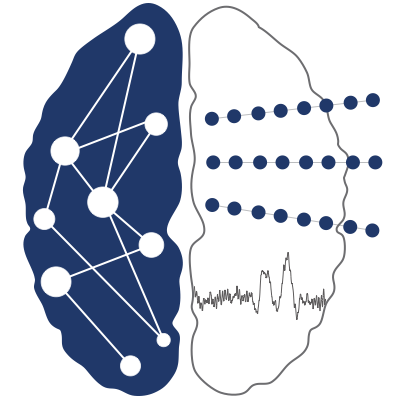

<h1 align="center">Human Intracranial Cognitive Neurophysiology</h1>

<h3 align="center">From single units to large-scale networks</h3>

This is the GitHub organization of the Helfrich Lab. It serves as a central place to host our research repositories, promoting transparency, reproducibility, and open scientific collaboration.

The goal of the Helfrich Lab is to unravel the neural network mechanisms supporting higher cognitive functions and their disturbances underlying neuropsychiatric disorders. We study the functional architecture of human cognition with a spatiotemporal resolution spanning single units to large-scale network activity.

In particular, we seek to understand context-dependent, goal-directed behavior in humans through the study of neural network dynamics with a particular emphasis on prefrontal cortex (PFC) physiology. The key hypothesis is that context dependent endogenous brain activity shapes cognitive processing in different cortical states, i.e. wakefulness or sleep. A core interest is the systematic investigation of the functional network architecture of cortico-cortical and subcortico-cortical interactions supporting cognitive processes such as attention and memory and their impairment in healthy aging and neurodegenerative diseases.
